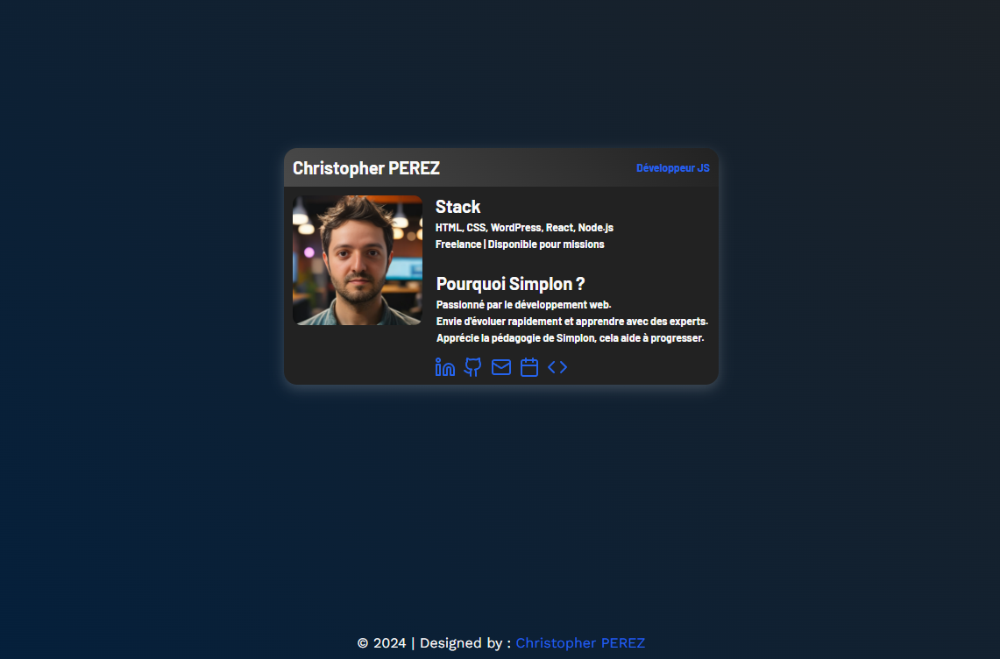

# 📇 Projet Carte de Visite Web

Ce projet consiste à réaliser une carte de visite en format site web en utilisant **HTML5 et CSS3**. L'objectif est de proposer une présentation interactive et moderne tout en respectant les bonnes pratiques de structuration et de mise en page.

Projet réalisé par <a href="https://github.com/Chr1stopherPerez" target="_blank">Christopher PEREZ</a>, pour un brief demandé par [SIMPLON](https://www.simplon.co/).

## But du Projet

L'objectif principal est de créer une carte de visite digitale afin de mettre en avant mes compétences et informations professionnelles. Ce projet permet de démontrer ma maîtrise des fondamentaux du développement web en utilisant uniquement **HTML** et **CSS**, tout en appliquant les bonnes pratiques de structuration et de conception.

## Fonctionnalités

- **Carte de visite digitale** : Affiche mes informations principales.
- **Design moderne** : Utilisation de polices personnalisées et d'une interface responsive.
- **Accessibilité** : Respect des bonnes pratiques en HTML et CSS.

### Technologies Utilisées


---

## Structure du Projet

- **`index.html`** : Contient la structure de la carte de visite.
- **`src/css/styles.css`** : Fichier CSS pour la mise en forme.
- **`src/assets/images/`** : Contient les images.
- **`src/assets/font/`** : Contient les polices utilisées.

---

### Configuration

1. **Cloner le projet**

   ```bash
   git clone https://github.com/Chr1stopherPerez/Projet_Carte_de_Visite.git

   ```

2. **Ouvrir le fichier**
   index.html dans un navigateur.

---

## Captures d'Écran


